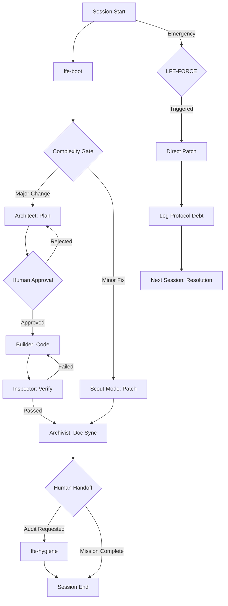

# LFE Assembly Line — Workflow Protocol

This document defines the lifecycle of a task within a Library-First Engineering (LFE) repository.

---

## Phase 0: The Complexity Gate (Start of Session)
Before any work begins, the **Architect** must orient themselves and ask the human:

> *"Is this a **Major Architectural Change** (Full Pipeline) or a **Minor Fix** (Scout Mode)?"*

### 🟢 Choice A: Scout Mode (Skill-Only: `/lfe-scout`)
Use for: Typos, UI tweaks, minor content fixes, or non-architectural adjustments.
- **Activation**: The human **MUST** explicitly trigger the toolbelt via `/lfe-scout`.
- **Enforcement**: If the human requests a fix before running the skill, the agent must refuse and request the skill activation.
- **Limit**: Cannot Add/Delete/Rename files or change project structure.
- **Report**: A "Maintenance Report" must be generated upon completion.

### 🔴 Choice B: Full Pipeline (Rigorous)
Use for: New features, architectural changes, core logic edits, or complex debugging.
Proceed to **Phase 1**.

---

## Phase 1: Architect (The Plan)
- **Task**: Deep-read the Library, understand the mission, and **Grill the User** (`/lfe-grill-me`) for any structural or logic changes.
- **Output**: A high-fidelity `.plans/active_plan.md`.
- **Handoff**: **STOP.** Wait for Human Approval of the plan.

## Phase 2: Builder (The Code)
- **Task**: Implement the approved plan in `src/**` using vertical slices.
- **Handoff**: Notify the Inspector.

## Phase 3: Inspector (The Verification)
- **Task**: Run tests and verify against domain truth.
- **Handoff**: Notify the Archivist or send back to Builder for fixes.

## Phase 4: Archivist (The Documentation)
- **Task**: Sync ADRs, update CHANGELOG, and finalize `pipeline_status.md`.
- **Handoff**: **STOP.** Ask the human:
> *"Mission Complete. Do you want to run a manual `/lfe-hygiene` audit before we close this session?"*

---

## Failure Recovery
If at any point the agent becomes confused or encounters an undocumented "Black Box" in the code, it must:
1. Stop all execution.
2. Escalate to the **Architect**.
3. Run `/lfe-extract-domain` to interview the human and update the Library.
