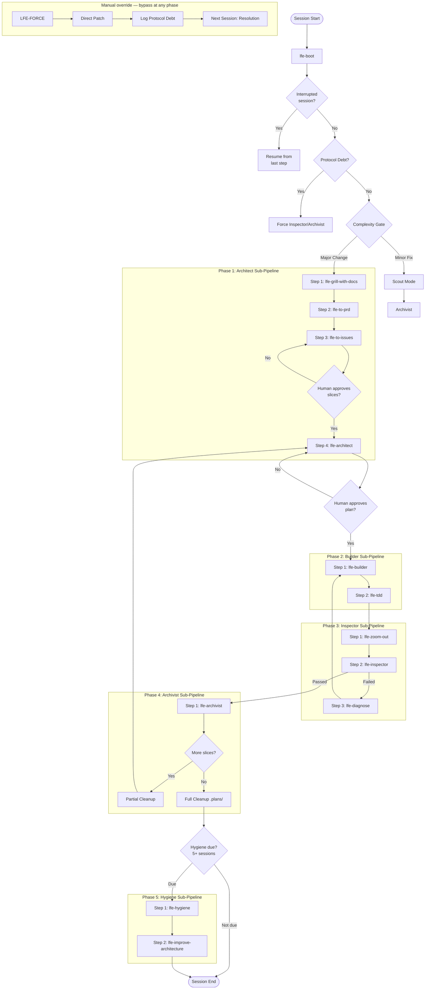

# LFE Assembly Line — Workflow Protocol

This document defines the lifecycle of a task within a Library-First Engineering (LFE) repository.



---

## Coordination Layer: `.plans/` as Transaction Log

Every skill writes its output to a physical file. The next skill reads that file, not the conversation.

```
.plans/
├── 01_grill_summary.md      ← Output of lfe-grill-with-docs
├── 02_prd.md                 ← Output of lfe-to-prd (reads 01)
├── 03_slices.md              ← Output of lfe-to-issues (reads 02)
├── active_plan.md            ← Output of lfe-architect for current slice (reads 03)
├── builder_done.md           ← Output of lfe-builder (crash-recovery checkpoint)
├── tdd_report.md             ← Output of lfe-tdd (reads active_plan + builder_done)
├── critique.md               ← Output of lfe-inspector (Devil's Advocate pass)
├── inspection_report.md      ← Output of lfe-inspector (reads tdd_report)
├── diagnosis_report.md       ← Output of lfe-diagnose (conditional, on inspector fail)
└── hygiene_report.md         ← Output of lfe-hygiene (every 5 sessions)
```

The frontmatter contract for these files lives in [`COORDINATION_FILES.md`](COORDINATION_FILES.md).

**Lifecycle:**
- Files are **created** as each step completes
- Files are **read** by the next step as input
- Files are **archived or deleted** only when the Archivist closes the mission
- If a session crashes → files remain → next session reads `pipeline_status.md` + existing files → resumes

---

## Phase 0: The Complexity Gate (Start of Session)
Before any work begins, `lfe-boot` orients and asks:

> *"Is this a **Major Architectural Change** (Full Pipeline) or a **Minor Fix** (Scout Mode)?"*

### 🟢 Choice A: Scout Mode (Skill-Only: `/lfe-scout`)
Use for: Typos, UI tweaks, minor content fixes, or non-architectural adjustments.
- **Activation**: The human **MUST** explicitly trigger the toolbelt via `/lfe-scout`.
- **Enforcement**: If the human requests a fix before running the skill, the agent must refuse and request the skill activation.
- **Limit**: Cannot Add/Delete/Rename files or change project structure.
- **Report**: A "Maintenance Report" must be generated upon completion.

### 🔴 Choice B: Full Pipeline (Rigorous)
Use for: New features, architectural changes, core logic edits, or complex debugging.
Proceed to **Phase 1**.

---

## Phase 1: Architect Sub-Pipeline
Each step reads the previous step's coordination file.

| Step | Skill | Input | Output | Gate |
|---|---|---|---|---|
| 1 | `/lfe-grill-with-docs` | Conversation | `.plans/01_grill_summary.md` | — |
| 2 | `/lfe-to-prd` | `01_grill_summary.md` | `.plans/02_prd.md` | — |
| 3 | `/lfe-to-issues` | `02_prd.md` | `.plans/03_slices.md` | 🛑 Human approves slices |
| 4 | `/lfe-architect` | `03_slices.md` (current slice) | `.plans/active_plan.md` | 🛑 Human approves plan |

## Phase 2: Builder Sub-Pipeline

| Step | Skill | Input | Output |
|---|---|---|---|
| 1 | `/lfe-builder` | `active_plan.md` | Production code in `src/**` + `.plans/builder_done.md` |
| 2 | `/lfe-tdd` | `active_plan.md` + `builder_done.md` | `.plans/tdd_report.md` |

## Phase 3: Inspector Sub-Pipeline

| Step | Skill | Input | Output |
|---|---|---|---|
| 1 | `/lfe-zoom-out` | Codebase | System context map |
| 2 | `/lfe-inspector` | `tdd_report.md` *(or `PROTOCOL_DEBT.md` after LFE-FORCE)* | `.plans/critique.md` then `.plans/inspection_report.md` |
| 3 | `/lfe-diagnose` (if failed) | Failing behavior | `.plans/diagnosis_report.md` → back to Builder |

## Phase 4: Archivist Sub-Pipeline

| Step | Skill | Input | Output |
|---|---|---|---|
| 1 | `/lfe-archivist` | `inspection_report.md` | Updated docs, CHANGELOG, pipeline_status |
| 2 | Slice loop check | `03_slices.md` | Branch: Partial Cleanup (loop) or Full Cleanup (proceed) |
| 3a | Partial Cleanup *(more slices)* | Execution files | Delete `active_plan / builder_done / tdd_report / critique / inspection_report / diagnosis_report`; keep `01 / 02 / 03` |
| 3b | Full Cleanup *(mission complete)* | All `.plans/` files | Delete every coordination file (except `hygiene_report.md`, owned by Phase 5) |

The exact file lists are enumerated in [`lfe-archivist/SKILL.md`](../../.agents/skills/lfe-archivist/SKILL.md) Step 5; `lfe-hygiene` mirrors them for orphan detection.

## Phase 5: Hygiene Sub-Pipeline (every 5 sessions)

| Step | Skill | Input | Output |
|---|---|---|---|
| 1 | `/lfe-hygiene` | Full repo | `.plans/hygiene_report.md` |
| 2 | `/lfe-improve-architecture` | `hygiene_report.md` + CONTEXT.md | Deepening opportunities |

---

## Failure Recovery
If at any point the agent becomes confused or encounters an undocumented "Black Box" in the code, it must:
1. Stop all execution.
2. Escalate to the **Architect**.
3. Run `/lfe-extract-domain` to interview the human and update the Library.

## Emergency Protocol
See `GOVERNANCE.md` for the `LFE-FORCE` break-glass rule.
