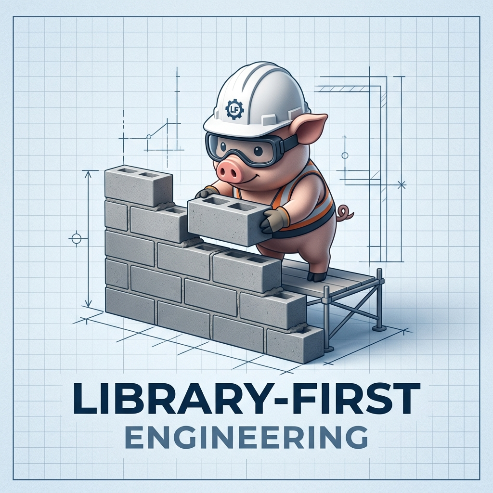
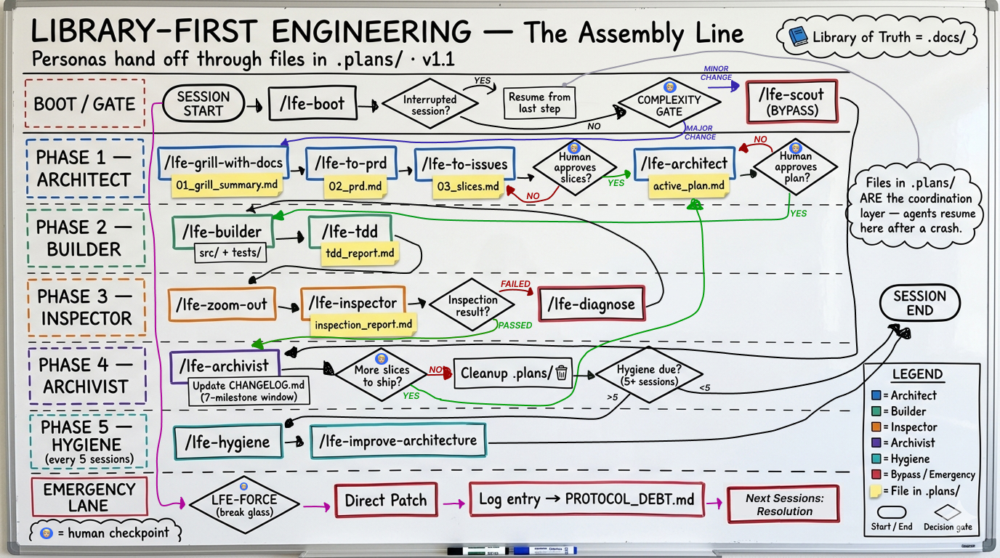
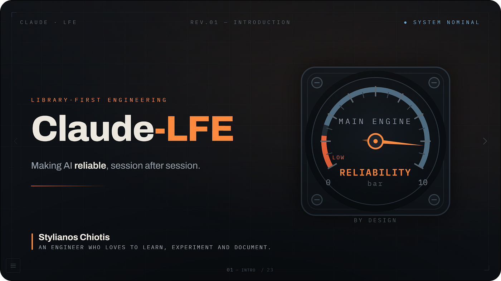

<h3 align="center"><em>Thinking in the Human · Processing in the AI · Truth in the Documentation</em></h3>

<table border="0" cellspacing="0" cellpadding="20">
  <tr>
    <td valign="middle"></td>
    <td valign="middle">
      <h1>🧱 Library-First Engineering</h1>
      

        <strong>A file-driven, persona-based framework for building production software with AI agents.</strong> 
        <em>Language-agnostic · IDE-agnostic · LLM-agnostic</em>
      

      
      
    </td>
  </tr>
</table>

> [!NOTE]
> **Status: stable, iterating.**  
> Active improvements only — no breaking changes are expected. New persona behaviors and sub-pipeline skills are added in a backwards-compatible way.

> [!TIP]
> **Quick start (60 seconds)**
> 1. Click *Use this template* on the GitHub page (or `git clone https://github.com/StChiotis/Library-First-Engineering.git my-project`).
> 2. Open in your IDE; run `/lfe-boot` at the start of every session. *No IDE adapter? In ChatGPT/Claude.ai or any raw LLM chat, paste [`.agents/adapters/system_prompt.txt`](.agents/adapters/system_prompt.txt) as your first message before running `/lfe-boot`.*
> 3. Answer the Complexity Gate: **Major Change** (full pipeline) or **Minor Fix** (`/lfe-scout`).
> 4. Run one feature end-to-end through Architect → Builder → Inspector → Archivist. One change per session.
>
> **You only ever type five commands** — `/lfe-boot`, `/lfe-whats-next`, `/lfe-scout`, `/lfe-extract-domain`, and the `LFE-FORCE` keyword. Everything else is dispatched by the AI based on your natural-language intent and approvals at the human gates. See [`USER_MANUAL.md`](USER_MANUAL.md) Section 0.
>
> Detailed guide: [Getting started](#getting-started) below. Philosophy: keep reading.

---

## What is Library-First Engineering?

**Library-First Engineering (LFE)** is a process framework — not a library, not a CLI, not a config file. It forces humans and AI agents to collaborate through a **structured, file-based assembly line of orchestration prompts** that guard against the three failure modes of AI-assisted coding:

- **Logic hallucination** — the model invents business rules instead of reading documented ones.
- **Context decay** — long sessions drift away from earlier decisions, producing inconsistent output.
- **Spaghetti architecture** — silent entropy after dozens of "just one more change" edits.

LFE replaces fragile chat logs with a **Library of Truth**: interconnected **prompts for LLM pipeline orchestration** that act as the operating system for every persona on the project. *(Today these prompts happen to live as Markdown — that's an implementation detail. The framework treats the structure as authoritative, not the file format. As more token-efficient formats emerge, LFE will follow.)*

### Why it pays off over time

LFE is not just defensive. The same discipline that prevents bad code also lowers the operational cost of AI-assisted engineering — every session, every month, every contributor:

- **Token efficiency.** Personas load only the prompts they need (their contract + the active mission's plan + the relevant slice of the library) — never the whole codebase or chat history.
- **Lower API spend.** Smaller context per call + fewer retries + no re-explaining the project every session = a flatter cost curve as the project grows.
- **Maintainability.** New contributors — human or AI — ramp by reading the library, not by archaeology through chat logs. Onboarding cost stops scaling with the codebase.
- **Reliability.** Same prompts + same library = same architectural decisions. Outputs are reproducible because inputs are explicit.
- **Compounding leverage.** Vanilla AI-coding workflows pay the same context tax forever. LFE pays it once — to the library — and then reuses it.

In one line: **LFE keeps the per-session cost — in tokens, in attention, and in retries — from compounding into debt you can't pay back.**

---

> [!TIP]
> **The Diagnostic — which house are you building?**
> - 🌾 **Straw** — one-shot prompts, no specs, no tests. *Looks fine in the demo, breaks on the first real change.*
> - 🪵 **Stick** — specs scattered in chat, no governance. *Works for a sprint, then turns brittle.*
> - 🧱 **Brick** *(LFE)* — file-based plans, persona-locked workflow, independent audit. *Resists entropy; pays a discipline tax instead of a debugging tax.*

---

## 30-second technical summary

LFE structures all AI-assisted work into a **persona-first assembly line**. Every step reads from, and writes to, physical files — with a clear two-tier memory model:

- `.plans/` — the **short-term coordination layer** for the active mission (wiped at end-of-mission).
- `.docs/` — the **long-term brain**, a cumulative knowledge base that survives across sessions and grows with the project.

No reliance on chat context. The graph below mirrors `.docs/protocol/ASSEMBLY_LINE.md`.

*Short-term: personas hand off through files in `.plans/`. Long-term: the cumulative brain lives in `.docs/` and survives every session. The Complexity Gate routes minor fixes to `/lfe-scout`; everything else flows through the full assembly line. `LFE-FORCE` is the emergency lane.*

<b>Click to expand — coordination layer, bypass routes, and persona tool-locking</b>

**Coordination layer.** Each skill writes to a file in `.plans/` and the next skill reads it:
`01_grill_summary.md` → `02_prd.md` → `03_slices.md` → `active_plan.md` → `plan_critique.md` → `builder_done.md` → `tdd_report.md` → `.plans/checks/*` → `critique.md` → `inspection_report.md`. If a session crashes, the files remain and `lfe-boot` resumes from the last step. Frontmatter schema and full registry: [`COORDINATION_FILES.md`](.docs/protocol/COORDINATION_FILES.md).

**Bypass routes** — when the full pipeline is overkill:

- **`/lfe-scout` (Flyweight Mode)** — the official bypass for minor fixes (typos, UI tweaks, simple bug fixes, &lt; 3 files). Forbidden from changing structure, dependencies, or core logic; auto-escalates to the Architect if any of those are required. This is the answer to "do I really need a full pipeline for a one-line fix?"
- **`LFE-FORCE`** — emergency break-glass for direct patches when no other route is viable. Logs an entry in `.docs/quality/PROTOCOL_DEBT.md` so the next session resolves the debt. See `.docs/protocol/GOVERNANCE.md`.

Personas are **tool-locked**: the Architect cannot edit code, the Builder cannot rewrite plans, the Inspector cannot edit production code, the Archivist cannot change behavior. A crashed session, a new contributor, or a different agent can resume exactly where the last one stopped.

**Pre-build critique gate (machine-checkable)** — Between plan approval and Builder start, `/lfe-plan-critique` runs a 5-lens review of the approved plan (Acceptance Criteria scrutiny, Test Feasibility, Domain Alignment, Structural Impact, Coherence Simulation) and writes typed frontmatter to `plan_critique.md`: `verdict` (PASS / WARN / BLOCK), `revision` counter, `brain_confirmation` timestamp. The Builder's Step 1 gate parses these fields and refuses to write `src/` unless the gate is open — *no conversational approval, no body-text markers*. The 2-revision limit survives crashes because the counter lives in the file, not in chat memory. Plan-critique findings also feed Inspector Step 1.5 (priority verification targets), so the artifact is load-bearing through the pipeline.

**Inspector specialist sub-skills** — Optional, opt-in via `.docs/quality/inspector-config.md`. Pure prompt-only sub-skills the Inspector dispatches during verification: `lfe-security-check` (OWASP Top-10), `lfe-perf-check`, `lfe-complexity-check`, `lfe-dep-audit`, `lfe-mutation-verify`. Each writes a typed findings file (`status: complete` + `kind: sub-skill` frontmatter); the Inspector aggregates them into `critique.md`. The resume rule is **`status: complete` only** — a partial mid-write doesn't get silently accepted on the next session. Per-mission overrides live in a typed `## Inspector Overrides` YAML block inside `active_plan.md`.

**LFE-FORCE hotfix audit** — Even when the assembly line is bypassed for a production emergency, the recovery session runs a fixed sub-skill subset on the hotfix (always `lfe-security-check` + `lfe-complexity-check`; conditional `lfe-dep-audit` + `lfe-perf-check`). Critical findings persist to `known-issues.md` before the debt entry resolves — the debt clears, but the risks remain visible. The most dangerous code path is the one that gets the audit; ad-hoc patches don't get a free pass.

**Correction cycle limit** — On the 2nd consecutive failed inspection of the same slice, the Inspector halts and presents the Brain with three triage options instead of looping forever. Same pattern for plan-critique BLOCK loops (2-revision file-based limit). See [`LOOP_ARCHITECTURE.md`](.docs/protocol/LOOP_ARCHITECTURE.md) Scenarios 1.4 and 2.2.

**Skill invocation authority** — The Brain types only `/lfe-boot`, `/lfe-whats-next`, `/lfe-scout`, `/lfe-extract-domain`, or `LFE-FORCE`. Every other skill is dispatched by the framework from within the assembly line. Skills refuse direct invocation out of sequence (Hard Rule 0 on Inspector sub-skills + the Builder's machine-checkable gate). This keeps users from accidentally corrupting their own pipeline state. See [`LLM_AGENT_GUIDE.md`](LLM_AGENT_GUIDE.md) §8.8.

---

## Architecture at a glance

When an AI agent (or a human teammate) opens an LFE repo, it asks the same **six questions** every time. The framework answers each one with a dedicated file — so context is *looked up*, never guessed:

1. **Who am I right now?** → my persona contract.
2. **What step am I on, what's next?** → the live pipeline cursor.
3. **What's in active working memory?** → the current mission's plan files.
4. **What's already true in this codebase?** → the documentation library.
5. **What am I forbidden from doing?** → the IDE rule files and governance.
6. **How should I write what I write?** → the format contracts.

**Two boundary rules, a scaling model, and strict mechanical loop closures** keep the system deterministic:

- **Mechanical Loop Closures.** Every phase of the pipeline requires a physical file to be written to `.plans/` before control is passed. If a crash occurs, the system reads these files to resume exactly where it left off. For an exhaustive map of how the framework handles crashes, multi-slice pivots, and emergency overrides, see [`LOOP_ARCHITECTURE.md`](.docs/protocol/LOOP_ARCHITECTURE.md).
- **Framework surface vs. product code.** The framework lives in `.docs/`, `.plans/`, `.agents/`, and a handful of root files. Everything else is product code. Agents must not mix the two.
- **Memory has retention, not infinite scrollback.** Long-term memory lives in a **7-milestone rolling window** in `.docs/quality/CHANGELOG.md`. Short-term memory lives in `.plans/` and is wiped by the Archivist at end-of-mission. When an agent asks *"what shipped recently?"*, the answer is `CHANGELOG.md` — not chat history, not git log.
- **Distributed Library Scaling.** To prevent context window bloat, knowledge scales across three tiers: **Tier 1** (Master Floor Map in `.docs/README.md`) → **Tier 2** (Shelf Indexes in folders with 3+ files) → **Tier 3** (Atomic Docs split at ~1,500 tokens).

> [!TIP]
> Every question your AI agents currently improvise the answer to has a single, file-backed source of truth in LFE.

For projects with multiple bounded contexts (e.g., separate Billing and Inventory domains with their own languages), LFE supports federation via [`CONTEXT-MAP.md`](.docs/domain/CONTEXT-MAP.md). Most projects don't need it.

<b>Click to expand — exact file paths for each question</b>

| # | The question | Where the answer lives |
| :-- | :--- | :--- |
| 1 | **Identity** — *Who am I right now?* | `.docs/protocol/PERSONAS.md` — tool-locked persona contracts |
| 2 | **Process** — *What step am I on, what's next?* | `pipeline_status.md` (live cursor) + `.docs/protocol/ASSEMBLY_LINE.md` (reference) + the active `.agents/skills/<name>/SKILL.md` |
| 3 | **State** — *What is the active mission's working memory?* | `.plans/` — numbered coordination files (`01_grill_summary.md` → `02_prd.md` → `03_slices.md` → `active_plan.md` → `plan_critique.md` → `builder_done.md` → `tdd_report.md` → `.plans/checks/*` → `critique.md` → `inspection_report.md`); schema in [`COORDINATION_FILES.md`](.docs/protocol/COORDINATION_FILES.md) |
| 4 | **Knowledge** — *What is already true in this codebase?* | `.docs/` library — start at `.docs/README.md` (the floor map); canonical terms in `CONTEXT.md` (repo root); ADRs in `.docs/architecture/`; domain logic in `.docs/domain/` |
| 5 | **Rules** — *What am I forbidden from doing?* | `.docs/protocol/GOVERNANCE.md` + the IDE adapter files (`CLAUDE.md`, `.cursorrules`, `.antigravityrules`, `.windsurfrules`, `.clinerules`) + `.github/copilot-instructions.md` |
| 6 | **Format** — *How should I write what I write?* | Schema contracts: `lfe-grill-with-docs/CONTEXT-FORMAT.md`, `lfe-grill-with-docs/ADR-FORMAT.md`, plus convention docs in `lfe-tdd/` and `lfe-improve-architecture/` |

---

## Why LFE beats vanilla AI workflows

| Feature | Standard AI Workflow | Paid Vibe-Coding Platforms | **LFE Framework** |
| :--- | :--- | :--- | :--- |
| **Logic source** | Scattered, often hallucinated | Inferred from prompts; no authoritative source | Centralized in `CONTEXT.md` |
| **Verification** | Self-verified by the same agent | Visual preview only | Independent Inspector audit |
| **Plan gating** | Implicit / conversational approval | None | Typed file-based gate — `verdict` + `revision` counter + `brain_confirmation` timestamp parsed by the Builder; the gate survives crashes |
| **Quality auditing** | Self-claimed by the agent | None | Pluggable specialist sub-skills (OWASP, perf, complexity, dep, mutation) — opt-in per project, typed findings files |
| **Hotfix safety** | None | None | LFE-FORCE recovery auto-runs security + complexity audits; Critical findings persist to `known-issues.md` |
| **Failure looping** | Unbounded retries | Unbounded retries | 2-cycle correction limit + 2-revision plan-critique limit; Brain triage menu instead of token burn |
| **Recovery** | Re-prompt from memory | Fork the project and retry | Resume from `.plans/` after any crash — counters and gates are file-based, not conversational |
| **Skill discipline** | Whatever the user types | UI-driven, opaque | Five user-typeable commands; the rest is framework-dispatched and refuses direct invocation |

*Vibe-coding platforms cited (as of 2026-Q1; this category evolves quickly): Lovable, v0, Bolt, Replit Agent.*

---

## What LFE buys you

### **💰 Cost & efficiency · ✅ Quality & correctness · 🛡️ Resilience & scale**

| **Lower token cost** | **No hallucinated logic** | **Crash-safe resume** |
| :---: | :---: | :---: |
| **Flatter cost curve** | **Reproducible decisions** | **Maintainable at scale** |
| **Faster onboarding** | **Independent persona audit** | **IDE & agent portable** |
| **Lean context window** | **Audit-trail by default** | **Spaghetti-proof architecture** |
| **Five commands to learn** | **Machine-checkable gates** | **Bounded failure loops** |

Token efficiency in LFE is architectural — lean per-persona context, file-based memory, no re-explaining the project every session — rather than a tracked metric.

---

## The Alignment Paradox

LFE is **IDE-agnostic** by design — but the human-in-the-loop discipline shifts depending on what kind of tool you're driving. There are two distinct categories, with opposite failure modes:

- **Guided IDEs** (e.g., **Cursor**, GitHub Copilot, Windsurf, Cline) — *you* stay in the driver's seat. The AI suggests inline; you accept, reject, or rewrite each diff. Failure mode: **drift**. The model interprets intent loosely, takes small liberties, and silently rewrites things you didn't ask for. Your job is to *constrain* it — set tight rules, review every diff, refuse off-scope changes.
- **Agentic applications** (e.g., **Antigravity**, Devin, Claude Code in agent mode, Cursor's agent tier) — the AI takes the wheel. You hand over a goal, walk away, come back to a finished branch. Failure mode: **excessive obedience**. The agent executes exactly what you ask — even when you ask wrong. Your job is to *write better instructions* — front-load context, define done criteria, document the domain rules it must obey.

Both categories produce broken architecture by opposite paths. LFE supplies the rails that catch drift *and* the documentation that prevents you from giving an obedient agent the wrong orders. **The framework supplies the discipline; the human still has to stay on the rails. No framework survives a driver who keeps overriding it.**

---

## The 5 Pillars

1. **📚 The Library System** — orchestration prompts organized as a structured library, not a dump.
2. **🧠 Persona Sovereignty** — separate thinking from doing; assign clear roles.
3. **⚖️ Logic Sovereignty** — domain rules are absolute and explicit.
4. **⏳ The Rolling Window** — archive stale context to keep working memory lean.
5. **📂 File-Based Coordination** — every step is a file, so crashes and handoffs are recoverable.

The framework defines five personas including 🫵 **The Brain — You**. The human is a first-class persona with their own contract and Definition of Done — see [PERSONAS.md](.docs/protocol/PERSONAS.md). Defaults are tunable per project via `LLM_AGENT_GUIDE.md`.

---

## Getting started

> LFE is a framework, not a package. There is nothing to install. You adopt the pattern in your own repo.

**👉 Start Here:** Read the [**LFE User Manual: The Human Guide**](USER_MANUAL.md) for a straightforward, end-to-end cheat sheet on how to drive this framework day-to-day.

1. **Use this template** — click *Use this template* on the GitHub page, or:

	git clone https://github.com/StChiotis/Library-First-Engineering.git my-project

2. **Adopt the canonical layout**:
   - `.docs/` — the Library of Truth (`architecture/`, `domain/`, `protocol/`, `quality/`, `strategy/`).
   - `.agents/skills/` — persona prompts and sub-pipeline skills (`lfe-architect`, `lfe-builder`, `lfe-inspector`, `lfe-archivist`, `lfe-scout`, plus the sub-pipeline skills).
   - `CLAUDE.md` / `.cursorrules` / `.windsurfrules` / `.clinerules` / `.antigravityrules` — IDE adapters.
   - `.plans/` — empty by default; populated per session as the transaction log.
3. **Boot LFE** — run `/lfe-boot` at the start of every session. The boot skill orients the agent, checks for an interrupted session, and offers the **Complexity Gate**: full pipeline for major changes, `/lfe-scout` for minor fixes.
4. **Run one feature end-to-end** — Architect → Builder → Inspector → Archivist. One change per session. No parallel pipelines.

> [!IMPORTANT]
> **Operational discipline.** Quality over quantity. **One change per session, one pipeline at a time.** Parallel pipelines defeat the file-based coordination model.

---

## Scaling LFE — adoption tiers

LFE is fully operational from session one with zero install. Optional enhancements add platform-level enforcement as the project matures:

| Tier | What you adopt | When |
| :--- | :--- | :--- |
| **0 — Solo** | Clone + `/lfe-boot`. No install, no config. Full pipeline enforced via skills + adapters. | Day 0 |
| **1 — Team** | Add CI/CD (GitHub Actions) as a Cloud Inspector. Add PR templates with an LFE compliance checklist. | When collaborating |
| **2 — Production** | Add `CODEOWNERS` for Logic Sovereignty paths. Add pre-commit hooks + secret scanning. | Before public release |

> [!NOTE]
> CI/CD and platform governance are **always optional**. LFE never mandates a specific toolchain. Adopt each tier only when it solves a real pain — see [`.docs/protocol/INDUSTRY_STANDARDS.md`](.docs/protocol/INDUSTRY_STANDARDS.md) for implementation references.

---

## Working with Claude? Use the distribution.

*Click the slide for the full story — the launch essay on Medium.*

**[Claude-LFE](https://github.com/StChiotis/Claude-LFE)** is the ready-to-clone **Claude Code** distribution of this framework — the same protocol you just read, plus the layer the agnostic core deliberately leaves to platforms: **runtime enforcement** (a warn-first gate family that makes drift loud, expensive, and logged) and **measured reliability** (its quality checks are *graded, not trusted* — a planted-defect eval harness with hash-pinned prompts, behind 1,100+ structural tests).

The bottleneck in agentic software isn't capability — it's **trust**: *verify the artifact, not the agent.* The core gives you the discipline; the distribution makes it mechanically enforced and measured, not asserted. Launch essay: [The Bottleneck in Agentic Software Isn't Capability. It's Trust](https://medium.com/towards-artificial-intelligence/the-bottleneck-in-agentic-software-isnt-capability-it-s-trust-claude-lfe-8665c0ff5fbd) · [intro deck](https://stchiotis.github.io/Claude-LFE.intro/).

---

## Known limitations

LFE is honest about what it does *not* solve:

- **Real-time multi-agent races.** LFE assumes serial handoffs; concurrent agents on the same `.plans/` directory will collide.
- **Non-text artifacts.** Designs, binary assets, and data files live outside the library and need their own discipline.
- **Very small scripts in non-LFE repos.** For sub-100-line one-offs outside an LFE project, framework overhead exceeds its benefit. Inside an LFE repo, use `/lfe-scout` instead.
- **Model capability floor.** Personas enforce structure, not competence. A weak model with LFE still ships weak code — just with better paperwork.

---

## Real-world reference implementation

LFE is actively being applied to a production project. A public case study — demonstrating the full pipeline on a live codebase — is in progress and will be published in a follow up [Article on Medium](https://medium.com/@StChiotis).

Until then: all 22 skills and the Blank Canvas are fully operational today. Clone the repo and run `/lfe-extract-domain` or `/lfe-boot` to start Day 0 on your own project.

---

## Contributing

LFE is an open-source framework. Improvements to persona prompts, governance rules, and case studies are welcome.

- Read [CONTRIBUTING.md](CONTRIBUTING.md).
- Open a [Discussion](https://github.com/StChiotis/Library-First-Engineering/discussions) for design questions.
- File an [Issue](https://github.com/StChiotis/Library-First-Engineering/issues) for framework drift or doc bugs.

---

## Credits

- **Framework design and LFE-native skills** — [Stylianos Chiotis](https://www.linkedin.com/in/stylianos-chiotis/).
- **Sub-pipeline skills** — adapted from [Matt Pocock's repo](https://github.com/mattpocock/skills) (`grill-with-docs`, `tdd`, `improve-codebase-architecture`, `zoom-out`), reframed and wired into the LFE assembly line as `lfe-grill-with-docs`, `lfe-tdd`, `lfe-improve-architecture`, and `lfe-zoom-out`.
- **Inspector specialist sub-skills, plan-critique gate, and correction-cycle pattern** — adopted from [Bryan Finster's `agentic-dev-team`](https://github.com/bdfinst/agentic-dev-team) (4-lens pre-build plan review; OWASP/performance/complexity/dependency/mutation specialist passes; 2-cycle correction limit; per-project sub-skill enable/disable), reframed and wired into the LFE assembly line as `lfe-plan-critique`, the five Inspector sub-skills (`lfe-security-check`, `lfe-perf-check`, `lfe-complexity-check`, `lfe-dep-audit`, `lfe-mutation-verify`), and the Inspector Cycle Guard + Sub-Skill Dispatch protocol.
- **Future integrations** from other skill repositories will be credited here as they're absorbed.

---

## License

MIT — use it, remix it, apply it anywhere. Attribution appreciated, not required.

---

  <strong>Prevent spaghetti. Build rigor. The Library-First way.</strong> 
  ⭐ Star the repo · 💬 Open a Discussion · 📝 Share the framework

