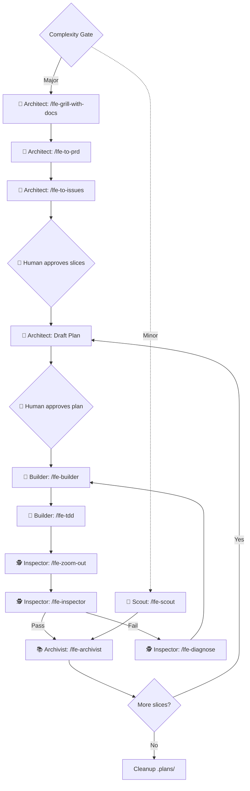

# Library-First Engineering (LFE)
 

  

<h2 align="center">
  The Enterprise Architecture Protocol for the Agentic Age. 
  <small><i>Thinking in the Human. Processing in the AI. Truth in the Documentation.</i></small>
</h2>

> **The Brick House Metaphor**  
> In the Agentic Age, most codebases are built of **Straw** 🌾 (one-off prompts) or **Stick** 🪵 (unstructured chat sessions). They look like houses, but they collapse when the "Big Bad Wolf" 🐺 of **Spaghetti Decay** and **Context Drift** blows.  
> 
> **LFE is the Brick House.** 🧱 We build block-by-block, using Documentation-as-Infrastructure to ensure your project remains standing, no matter how hard the AI blows.

In the era of AI-driven development, code is cheap but context is expensive. **Library-First Engineering (LFE)** is an architectural protocol that treats **Documentation-as-Infrastructure**—the operating system of your project.

This repository is a "Blank Canvas" template for AI-Founders and CTOs to bootstrap projects that are disciplined, AI-navigable, and resistant to "Spaghetti Decay."

---

## 🏛️ The LFE Process (V2)
LFE V2 orchestrates AI agents through **sub-pipelines per persona** with **file-based coordination** — each step writes a physical file that the next step reads, eliminating context window leakage.

> [!TIP]
> View the [Full Assembly Line Protocol](.docs/protocol/ASSEMBLY_LINE.md) for the complete V2 sub-pipeline architecture.
> Run `/lfe-whats-next` at any point for instant pipeline orientation.
> For mature, scaling projects, consider adopting our [Optional Industry Standards](.docs/protocol/INDUSTRY_STANDARDS.md) to enforce LFE at the CI/CD and platform level.

---

## 🏆 The LFE Benchmark vs. Standard AI Workflows

Most solo developers and teams building with AI today rely on "execute-first" chat sessions. While fast initially, this inevitably leads to project collapse. Here is how LFE benchmarks against the standard market approach:

### 1. Defeating "Spaghetti Decay"
- **Standard AI**: Acts as both Architect and Builder simultaneously. It will silently rewrite core logic on the fly to fix a bug, turning the codebase into spaghetti.
- **The LFE Advantage**: **Separation of Concerns**. By forcing the AI into strict Personas, the Architect *must* write the design in `.plans/` first, and the Builder is locked to that plan. Architecture becomes deliberate, not accidental.

### 2. Eliminating Context Window Bloat
- **Standard AI**: Relies on reading thousands of lines of raw code to understand the app, quickly maxing out token limits and causing severe hallucinations.
- **The LFE Advantage**: **Documentation-as-Infrastructure**. The AI reads the `.docs/README.md` Floor Map first. Because we enforce a strict 7-milestone rolling window for history and banish verbose chat logs to `.plans/`, the AI's "working memory" stays incredibly lean and efficient.

### 3. Preventing Logic Hallucination
- **Standard AI**: Guesses business rules and math formulas based on scattered code context.
- **The LFE Advantage**: **Logic Sovereignty**. The AI is strictly trained to treat `.docs/domain/domain-knowledge.md` as the supreme law. It will never guess a business rule; it will always look it up.

| Feature | Standard AI Workflow | **LFE Protocol (V2.0)** |
| :--- | :--- | :--- |
| **Autonomy** | Unrestricted (Cowboy Coding) | **Persona-Based Tool-Locking** |
| **Planning** | Implicit ("Just do it") | **Sub-Pipeline Skills with File-Based Coordination** |
| **Logic** | Scattered / Hallucinated | **Logic Centralization + Domain Language (`CONTEXT.md`)** |
| **Verification** | Self-Verified by AI | **Independent Inspector Audit (zoom-out → inspect → diagnose)** |
| **Governance** | Code-First (Spaghetti Decay) | **Docs-as-Infrastructure + ADR Governance** |
| **Safety** | Trust-Based | **Zero-Trust + Session Recovery via `.plans/`** |
| **Quality** | Optional / Ad-hoc | **Mandatory TDD Pass (red-green-refactor)** |
| **Maintenance** | Reactive | **Scheduled Architecture Sweeps (every 5 sessions)** |

---

## ⚠️ The Alignment Paradox (Why LFE needs YOU)
Modern LLMs are heavily trained (via RLHF) to be helpful sycophants. If you tell an AI to *"forget the rules and just do X"*, its core training will almost always override the project's protocol. 

**LFE cannot physically stop you from breaking your own rules.** The protocol is a shared contract between you and the agent. The "Complexity Gate" exists so *you* can enforce discipline on the *AI*. If you choose to bypass the gate and give raw, rule-breaking commands, the AI will happily oblige and cause Spaghetti Decay. **LFE is the pavement, but you must choose to drive on it.**

**Chat vs. Agentic Architectures:** You will experience varying degrees of protocol adherence depending on the AI tool you use. It is crucial to distinguish between the **Engine** (the model, like Claude 3.5 or GPT-4o) and the **Architecture** (the tool wrapping the model):
- **"Chat-based" IDEs** (e.g., **Cursor**, **GitHub Copilot**, **Windsurf**) prioritize immediate execution and obedience. Even if powered by an elite engine like Claude, they are highly susceptible to the Alignment Paradox and will break rules if you tell them to.
- **"Agentic" Architectures** (e.g., **Antigravity**, **Devin**, or CLI loops like **Claude Code**) are structurally designed to exercise judgment. Using the exact same engine, they will naturally enforce the LFE assembly line more strictly.

Regardless of your tooling, the integrity of the codebase ultimately relies on the founder honoring the process.

---

## 🏛️ The 5 Pillars of LFE V2

### 1. The Library System
A project is a library, not a dump. We enforce a three-layer hierarchy (**Entrance Card → Floor Map → Shelf Index**) to bound AI context and ensure agents find the truth in under 300 lines of orientation.

### 2. Persona Sovereignty
We separate "Thinking" from "Doing." By orchestrating AI into distinct personas (**Architect → Builder → Inspector → Archivist**), each running a defined **sub-pipeline of skills** in strict order, we enforce discipline that prevents "cowboy coding."

### 3. Logic Sovereignty
Domain logic is sacred. LFE ensures all core business rules are centralized in designated modules. The AI is trained to use the canonical vocabulary from `CONTEXT.md` and respect domain documentation as the sole authority.

### 4. The Rolling Window
Knowledge has a shelf life. LFE maintains a lean "Active Working Memory" for AI agents by moving stale history to archives, preventing context-drift and hallucination.

### 5. File-Based Coordination (V2)
Every pipeline step writes a physical coordination file to `.plans/`. The next step reads that file — not the conversation. This eliminates context window leakage, enables session crash recovery, and creates an audit trail.

---

## 🚀 One-Sentence Marketing
- **For Enterprise CTOs**: "LFE is an AI-first repository architecture that prevents spaghetti decay by enforcing strict documentation and planning rules before AI writes a single line of code."
- **For AI Founders**: "LFE is a zero-config repository standard that bounds your AI's context window, saving you tokens and preventing hallucinations as your codebase scales."

---

## 🛠️ Quick Start
1. **Clone this structure** into your new project.
2. **Onboard the AI**: The repository includes pre-configured rule files for popular AI IDEs (`.cursorrules`, `.windsurfrules`, `.clinerules`, `.antigravityrules`, and `.github/copilot-instructions.md`). Alternatively, use the **[System Prompt Adapter](file:///.agents/adapters/system_prompt.txt)** for standalone agents.
3. **Boot the Protocol**: Ask your agent: *"I have adopted the LFE protocol. Run /lfe-boot to begin."*
4. **Navigate**: At any point, run `/lfe-whats-next` to see exactly where you are in the pipeline and what to do next.

---

## 🤝 Contributing
LFE is an open-source movement. Join us in refining the protocol to make AI-driven engineering more reliable.
- Check the **[CONTRIBUTING.md](CONTRIBUTING.md)**
- Licensed under **MIT**.

---

## 👤 Author & Vision
The **Library-First Engineering (LFE) Protocol** is the original creation and intellectual product of **Stylianos Chiotis**. 

> *"My mission is to give everyone a framework to bring their ideas to life in the most efficient way possible. I believe that **the pavement is the first thing you lay before you build a house.** LFE is that pavement—a solid foundation that ensures future scalability, maintainability, and reliability in the Agentic Age."* — **Stylianos Chiotis**

---

## 📜 Credits & Attributions
- **Utility Skills**: The core utility skills in the `.agents/skills` directory were inspired by and adapted from the open-source work of **[Matt Pocock](https://github.com/mattpocock/skills)** (`grill-with-docs`, `tdd`, `improve-codebase-architecture`, `zoom-out`). All skills have been reframed as LFE-native (`lfe-*`) with file-based coordination I/O, persona sub-pipeline positioning, and domain language governance.

---
*Prevent Spaghetti. Build Rigor. The Library-First Way.*
