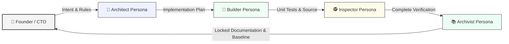

# 🧱 Library-First Engineering (LFE)

  

<h2 align="center">
  The Enterprise Architecture Protocol for the Agentic Age. 
  <small><i>Thinking in the Human. Processing in the AI. Truth in the Documentation.</i></small>
</h2>

> **The Brick House Metaphor**  
> In the Agentic Age, most codebases are built of **Straw** 🌾 (one-off prompts) or **Stick** 🪵 (unstructured chat sessions). They look like houses, but they collapse when the "Big Bad Wolf" 🐺 of **Spaghetti Decay** and **Context Drift** blows.  
> 
> **LFE is the Brick House.** 🧱 We build block-by-block, using Documentation-as-Infrastructure to ensure your project remains standing, no matter how hard the AI blows.

### 💡 Why Library-First Engineering?
In the era of AI-driven development, code is cheap but context is expensive. **Library-First Engineering (LFE)** is an architectural protocol that treats **Documentation-as-Infrastructure**—the operating system of your project. It is a framework for AI-Founders and CTOs to bootstrap projects that are disciplined, AI-navigable, and resistant to context degradation.

---

## 🏛️ The Persona-First Assembly Line

Most software teams operate without role definition when interacting with AI models, leading to overlapping intents and context drift. LFE separates concerns through **distinct personas**, each responsible for a single stage in the development lifecycle:

> [!TIP]
> **Looking for the technical details?** Read the **[Deep Dive Full Protocol Documentation](.docs/README.md)** to see exact step-by-step file handoffs and the V2 sub-pipeline architecture.

---

## 🏆 The LFE Advantage vs. Standard Workflows

### 1. Defeating "Spaghetti Decay"
- **Standard AI**: Acts as both Architect and Builder simultaneously. It silently rewrites core logic on the fly to fix a bug, turning the codebase into spaghetti.
- **The LFE Advantage**: **Separation of Concerns**. By forcing the AI into strict Personas, the Architect *must* write the design first, and the Builder is locked to that plan. Architecture becomes deliberate, not accidental.

### 2. Eliminating Context Window Bloat
- **Standard AI**: Relies on reading thousands of lines of raw code to understand the app, causing severe hallucinations.
- **The LFE Advantage**: **Documentation-as-Infrastructure**. The AI reads the Floor Map first. Stale history is moved to the archives, keeping the AI's "working memory" incredibly lean and efficient.

### 3. Preventing Logic Hallucination
- **Standard AI**: Guesses business rules and math formulas based on scattered code context.
- **The LFE Advantage**: **Logic Sovereignty**. The AI is explicitly trained to treat the documentation as the supreme authority. It will never guess a business rule; it will always look it up.

| Feature | Standard AI Workflow | **LFE Protocol** |
| :--- | :--- | :--- |
| **Autonomy** | Unrestricted (Cowboy Coding) | **Persona-Based Tool-Locking** |
| **Planning** | Implicit ("Just do it") | **Sub-Pipeline Skills with File-Based Coordination** |
| **Logic** | Scattered / Hallucinated | **Logic Centralization + Domain Language (`CONTEXT.md`)** |
| **Verification** | Self-Verified by AI | **Independent Inspector Audit** |
| **Governance** | Code-First | **Docs-as-Infrastructure + ADR Governance** |
| **Safety** | Trust-Based | **Zero-Trust + Session Recovery via `.plans/`** |

---

## ⚠️ The Alignment Paradox (Why the Human in the Loop Matters)

AI models are trained to be **helpful and obedient**. If you tell an AI to ignore rules, take a shortcut, or skip documentation, it will gladly do so—even if that leads to "Spaghetti Decay" and a broken architecture. 

This creates a paradox: **The AI is too polite to say "No" to your bad ideas.** 

LFE provides strict rules and guardrails, but **you** must choose to enforce them:
- **Think of LFE as the pavement.** It keeps you on track, but you have to keep your hands on the steering wheel.
- **Honor the process.** If you bypass the checkpoints and give raw, unstructured commands, the AI will obey you, but your codebase will suffer. 

No matter whether you use Chat IDEs (like Cursor and Windsurf) or fully autonomous agents (like Antigravity), the ultimate success of the project relies on **your discipline to keep the AI aligned.**

---

## 🏛️ The 5 Pillars of Library-First Engineering

To prevent project collapse, LFE stands on five core operational pillars:

- **📚 1. The Library System**: We treat documentation as a structured library, not a dump. This allows the AI to immediately find the single source of truth without searching the whole codebase.
- **🧠 2. Persona Sovereignty**: We separate "thinking" from "doing." By assigning clear roles (Architect, Builder, Inspector, Archivist), we prevent chaotic, ad-hoc edits.
- **⚖️ 3. Logic Sovereignty**: Domain logic is absolute. Core business rules are explicitly written and strictly followed, eliminating AI improvisation.
- **⏳ 4. The Rolling Window**: We archive stale chats and history. By keeping the AI's "active memory" lean, we prevent hallucinations as the project scales.
- **📂 5. File-Based Coordination**: Every step is tracked via actual files (`.plans/`). This prevents the AI from getting confused over long chat logs and enables instant crash recovery.

---

## 🚀 One-Sentence Marketing
- **For Enterprise CTOs**: "LFE prevents spaghetti decay by enforcing strict documentation and planning rules before AI writes a single line of code."
- **For AI Founders**: "LFE bounds your AI's context window, saving you tokens and preventing hallucinations as your codebase scales."

---

## 🛠️ Quick Start

1. **Clone this structure** into your new project.
2. **Onboard the AI**: The template includes ready-to-use rule files for popular AI IDEs (`.cursorrules`, `.windsurfrules`, `.clinerules`, `.antigravityrules`).
3. **Boot the Protocol**: Run `/lfe-boot` at the start of **every** session to orient the agent.

> [!IMPORTANT]
> **Operational Discipline:** We practice *Quality over Quantity*. Work on exactly **one change per session** and execute **one pipeline at a time** (no parallel or simultaneous pipelines).

---

## 🤝 Contributing

LFE is an open-source movement. Join us in refining the protocol to make AI-driven engineering more reliable.
- Check the **[CONTRIBUTING.md](CONTRIBUTING.md)**
- Licensed under **MIT**.

---

## 👤 Author & Vision
Authored and maintained by **Stylianos Chiotis**. 

> *"My mission is to give everyone a framework to bring their ideas to life in the most efficient way possible. I believe that **the pavement is the first thing you lay before you build a house.** LFE is that pavement—a solid foundation that ensures future scalability, maintainability, and reliability in the Agentic Age."* — **Stylianos Chiotis**

---

## 📜 Credits & Attributions
- **Utility Skills**: The core utility skills in the `.agents/skills` directory were inspired by and adapted from the open-source work of **[Matt Pocock](https://github.com/mattpocock/skills)** (`grill-with-docs`, `tdd`, `improve-codebase-architecture`, `zoom-out`). All skills have been reframed as LFE-native (`lfe-*`) with file-based coordination I/O, persona sub-pipeline positioning, and domain language governance.

---

*Prevent Spaghetti. Build Rigor. The Library-First Way.*

